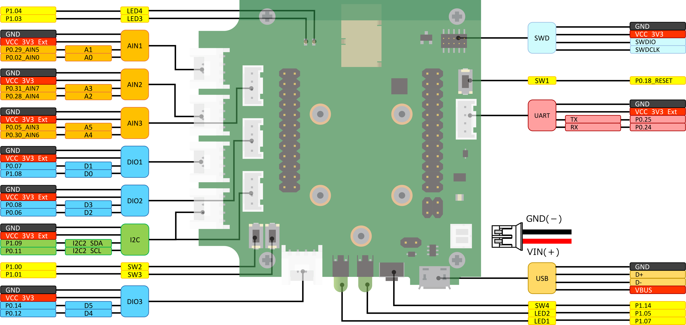

# Degu Baseboard / Degu ベースボード

This repository contain the Degu baseboard circuit, BOM and reference of parts number on PCB.  
このリポジトリにはDeguベースボードの回路図、部品表、基板上の部品配置図が含まれます。

# Hardware Overview / 概要

- Analog Port: include 3 anlog ports, AIN1, AIN2 and AIN3.
- Digital Port: include 3 digital ports, DIO1, DIO2 and DIO3.
- UART Port: 1 UART port.
- I2C Port: 1 I2C port.
- USB Port: 1 micro USB port.
- SWD Port: 1 SWD port.
- Switch: include 4 switchs, SW1 for resets, SW4 for DFU with bootloader , SW2 and SW3 are generic use.
- LED: include 4 LEDs(GREEN), LED1 and LED2 are lead type round top molded, LED3 and LED4 are surface mounted.
- UART Port: 1 UART Port.

------

- アナログポート: アナログ ポート * 3, AIN1、AIN2、AIN3
- デジタルポート: デジタルポート * 3, DIO1、DIO2、DIO3
- UARTポート: UART ポート * 1
- I2C ポート: I2C ポート * 1
- USB ポート: micro USB ポート * 1
- SWD ポート: SWD ポート * 1
- スイッチ: SW1はリセットボタンです。SW4はブートローダーをDFUモードにするために使います。 SW2とSW3は汎用スイッチです。
- LED: 緑色 * 4, LED1とLED2は砲丸型です。 LED3とLED4は表面実装型です。

## Pin Headers / ピンヘッダー

- Pin Headers: include 2 Pin headers, same lines to connected with AIN,DIO,UART,I2C Ports and extra 5 gpios.

-----

- ピンヘッダー: AIN,DIO,UART,I2C ポートと同じ信号が接続されています。それ以外に追加の5本のGPIO接続されています。

# Power Supply / 電源投入方法

-   ①USB microBコネクタ経由での5V給電
-   ②JST 2pin PHコネクタ経由での3.3V～5.5V給電
-   ③ JST 2pin PHコネクタ経由での3V給電(コイン電池等)

## JST 2pin PHコネクタ経由で給電する祭の注意

初回出荷品に関して、CON12 PHコネクタに接続されているケーブルの極性が
逆向きになっている可能性があり、逆向きの状態で給電した場合、故障する可能性があります。
接続されているケーブルの色が、基板のシルク印字に対して、赤：VIN，黒：GNDとなっていることを確認してください。
極性が逆向きになっている場合には交換対応いたしますので、購入店までお問い合わせください。

### ① USB microBコネクタ経由での5V給電時

|リファレンス番号|状態|
--|--
|JP1|1-2pinをショート|
|JP2|1-2pinをショート|
|JP3|1-2pinをショート|

### ② JST 2pin PHコネクタ経由での3.3V～5.5V給電

|リファレンス番号|状態|
--|--
|JP1|1-2pinをショート|
|JP2|1-2pinをショート|
|JP3|1-2pinをオープン|

### ③ JST 2pin PHコネクタ経由での3V給電(コイン電池を想定)

この設定の場合はPHコネクタからの入力電圧が3.6Vを超えることの無いようにしてください。\

|リファレンス番号|状態|
--|--
|JP1|JP1の1pin-JP2の1pinをショート|
|JP2|JP1の2pin-JP2の2pinをショート|
|JP3|1-2pinをオープン|

